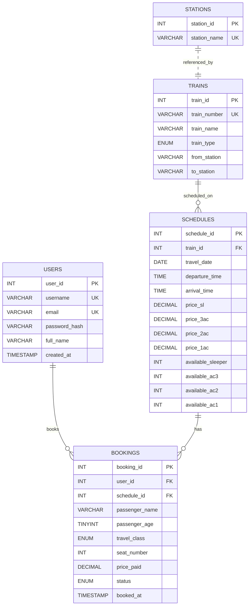

# T!CKET — Railway Ticket Booking Platform

> **A full-stack DBMS project demonstrating ACID-compliant ticket booking with MySQL, Flask, and a premium UI.**

---

## Table of Contents

- [Overview](#overview)
- [Key DBMS Concepts Demonstrated](#key-dbms-concepts-demonstrated)
- [Tech Stack](#tech-stack)
- [Project Structure](#project-structure)
- [Database Architecture](#database-architecture)
  - [ER Diagram](#er-diagram)
  - [Schema Design (3NF)](#schema-design-3nf)
  - [Views](#views)
  - [Indexing Strategy](#indexing-strategy)
- [Transaction Management & Concurrency Control](#transaction-management--concurrency-control)
  - [Pessimistic Locking (SELECT ... FOR UPDATE)](#pessimistic-locking-select--for-update)
  - [ACID Compliance](#acid-compliance)
- [Application Features](#application-features)
  - [User-Facing Features](#user-facing-features)
  - [Admin Dashboard](#admin-dashboard)
- [SQL Operations Reference](#sql-operations-reference)
- [Setup & Installation](#setup--installation)
- [Environment Variables](#environment-variables)
- [Deployment](#deployment)
- [Credits](#credits)

---

## Overview


**T!CKET** is a railway ticket booking platform built as a Database Management Systems (DBMS) academic project. It simulates a real-world train reservation system where multiple users can concurrently search for trains, select seats from an interactive seat map, and book tickets — all backed by a **MySQL** relational database that enforces data integrity through normalization, foreign key constraints, and pessimistic concurrency control.

The project goes beyond a simple CRUD application by implementing:

- **Third Normal Form (3NF)** schema design to eliminate redundancy
- **Pessimistic row-level locking** (`SELECT ... FOR UPDATE`) to prevent double-booking under concurrent access
- **ACID transactions** ensuring atomicity of the book → decrement-seat → commit pipeline
- **Database Views** for efficient, reusable query abstraction
- **Composite indexing** for optimized route and date lookups
- A complete **Admin Dashboard** for direct SQL-backed entity management


---

## Key DBMS Concepts Demonstrated

| Concept | Where It's Applied |
|---|---|
| **Normalization (3NF)** | Separate `users`, `stations`, `trains`, `schedules`, `bookings` tables eliminate transitive dependencies |
| **Primary & Foreign Keys** | Every table uses `AUTO_INCREMENT` INT PKs; `bookings` references both `users` and `schedules` via FKs with `ON DELETE CASCADE` |
| **UNIQUE Constraints** | `UNIQUE KEY uq_seat (schedule_id, travel_class, seat_number)` prevents double-booking at the database level |
| **ENUM Types** | `train_type`, `travel_class`, and `status` use MySQL ENUMs for domain integrity |
| **Transactions (ACID)** | Booking flow uses `START TRANSACTION` → lock → insert → update → `COMMIT` (or `ROLLBACK` on failure) |
| **Pessimistic Concurrency** | `SELECT ... FOR UPDATE` acquires exclusive row-level locks during the booking transaction |
| **Views** | `available_seats_view` and `user_boarding_pass_view` abstract complex JOINs for reuse |
| **Indexing** | Composite `idx_route (from_station, to_station)` and `idx_date (travel_date)` for search optimization |
| **Aggregation** | Admin dashboard uses `COUNT(*)`, `SUM(price_paid)` for live statistics |
| **CASCADE Deletes** | Deleting a train cascades to its schedules, which cascades to bookings — maintaining referential integrity |

---

## Tech Stack

| Layer | Technology |
|---|---|
| **Database** | MySQL 8.x (InnoDB engine for transactional support) |
| **Backend** | Python 3.12, Flask 3.0.3 |
| **DB Connector** | `mysql-connector-python` 9.0.0 |
| **Frontend** | HTML5, Vanilla CSS, Vanilla JavaScript, Jinja2 Templates |
| **Fonts** | Google Fonts (Inter, Syncopate, Orbitron) |
| **Icons** | Font Awesome 6.4 |

---

## Project Structure

```
t1cket/
├── app.py                    # Flask application — all routes and business logic
├── init_db.py                # Database initialization and seed data script
├── schema.sql                # Complete MySQL schema (tables, views, indexes)
├── requirements.txt          # Python dependencies
├── .env                      # Environment variables (DB credentials)
├── .gitignore                # Git exclusion rules
│
├── static/
│   ├── css/
│   │   └── style.css         # Global stylesheet (design system, custom cursor, clock)
│   └── images/
│       └── train.png, ...    # Hero images and UI assets
│
└── templates/
    ├── base.html             # Master layout (navbar, cursor, clock, theme toggle)
    ├── index.html            # Landing / hero page
    ├── auth.html             # Login & registration (dual-mode form)
    ├── search.html           # Train search with results grid
    ├── booking.html          # Interactive seat map and booking form
    ├── dashboard.html        # User's boarding passes (ticket cards)
    ├── profile.html          # User profile page
    ├── about.html            # About page
    └── admin/
        ├── layout.html       # Admin master layout with sidebar navigation
        ├── dashboard.html    # Admin stats overview (aggregated queries)
        ├── trains.html       # CRUD for trains table
        ├── stations.html     # CRUD for stations table
        ├── schedules.html    # CRUD for schedules table (dates/pricing)
        ├── users.html        # CRUD for users table
        └── tickets.html      # CRUD for bookings table
```

---

## Database Architecture

### ER Diagram



### Schema Design (3NF)

The database is normalized to **Third Normal Form (3NF)**:

1. **1NF**: All columns contain atomic values. No repeating groups exist.
2. **2NF**: Every non-key attribute is fully functionally dependent on the entire primary key (no partial dependencies since all PKs are single-column `AUTO_INCREMENT` integers).
3. **3NF**: No transitive dependencies exist. For example:
   - Train details (name, type, route) live in `trains`, not repeated in `schedules`.
   - User details live in `users`, not duplicated in `bookings`.
   - Pricing and seat counts are schedule-specific (same train, different dates = different prices), so they belong in `schedules`.

**Key Constraints:**

```sql
-- Prevents the same seat from being booked twice on the same schedule
UNIQUE KEY uq_seat (schedule_id, travel_class, seat_number)

-- Prevents duplicate schedules (one train per date)
UNIQUE KEY uq_train_date (train_id, travel_date)

-- Cascading deletes maintain referential integrity
FOREIGN KEY (train_id) REFERENCES trains(train_id) ON DELETE CASCADE
FOREIGN KEY (user_id) REFERENCES users(user_id) ON DELETE CASCADE
FOREIGN KEY (schedule_id) REFERENCES schedules(schedule_id) ON DELETE CASCADE
```

### Views

Two database views abstract complex multi-table JOINs into reusable virtual tables:

**`available_seats_view`** — Returns all confirmed seat bookings per schedule for the seat map:

```sql
CREATE VIEW available_seats_view AS
SELECT s.schedule_id, b.travel_class, b.seat_number
FROM schedules s
LEFT JOIN bookings b ON s.schedule_id = b.schedule_id AND b.status = 'confirmed';
```

**`user_boarding_pass_view`** — Joins bookings → schedules → trains to generate boarding pass data with a computed PNR code:

```sql
CREATE VIEW user_boarding_pass_view AS
SELECT
    b.booking_id, b.user_id, b.passenger_name, b.seat_number,
    b.travel_class, b.price_paid, b.status, b.booked_at,
    CONCAT('PNR', LPAD(b.booking_id, 8, '0')) AS pnr_code,
    s.travel_date, s.departure_time, s.arrival_time,
    t.train_name, t.train_number, t.from_station, t.to_station
FROM bookings b
JOIN schedules s ON b.schedule_id = s.schedule_id
JOIN trains t ON s.train_id = t.train_id;
```

### Indexing Strategy

| Index | Table | Purpose |
|---|---|---|
| `idx_route (from_station, to_station)` | `trains` | Composite index for fast route-based searching |
| `idx_date (travel_date)` | `schedules` | Date filtering optimization for schedule queries |
| `idx_user (user_id)` | `bookings` | Fast user-specific booking lookups |

---

## Transaction Management & Concurrency Control

### Pessimistic Locking (SELECT ... FOR UPDATE)

The most critical operation in the system is the seat booking flow. When two users attempt to book the same seat simultaneously, **pessimistic concurrency control** prevents a race condition:

```python
# Step 1: Disable autocommit to begin a manual transaction
db = get_db(autocommit=False)
cursor = db.cursor(dictionary=True)

# Step 2: Start explicit transaction
cursor.execute("START TRANSACTION")

# Step 3: Acquire an EXCLUSIVE ROW-LEVEL LOCK on the target seat
cursor.execute("""
    SELECT status FROM bookings
    WHERE schedule_id=%s AND travel_class=%s AND seat_number=%s
    FOR UPDATE
""", (schedule_id, travel_class, seat_number))
existing = cursor.fetchone()

# Step 4: Check if seat is already booked
if existing and existing['status'] == 'confirmed':
    db.rollback()
    flash('Seat just got booked by someone else!')
    return redirect(...)

# Step 5: Atomically insert booking and decrement availability
cursor.execute("INSERT INTO bookings (...) VALUES (...)")
cursor.execute("UPDATE schedules SET available_sleeper = available_sleeper - 1 WHERE ...")

# Step 6: Commit or rollback
db.commit()
```

**How it works:**
- `FOR UPDATE` acquires an **exclusive lock** on the matching row(s) in the `bookings` table.
- Any other transaction trying to `SELECT ... FOR UPDATE` the same row will **block** until the first transaction commits or rolls back.
- This ensures that even under high concurrency, no two users can book the same (schedule, class, seat) combination.
- The `UNIQUE KEY uq_seat` acts as a **safety net** — even if the application-level lock somehow fails, the database will reject the duplicate insert with an `IntegrityError`.

### ACID Compliance

| Property | Implementation |
|---|---|
| **Atomicity** | `START TRANSACTION` → operations → `COMMIT` / `ROLLBACK`. Either all operations succeed or none do. |
| **Consistency** | `UNIQUE KEY`, `FOREIGN KEY`, `ENUM`, and `NOT NULL` constraints ensure the database never enters an invalid state. |
| **Isolation** | `FOR UPDATE` provides serialized access to contested rows; InnoDB's default `REPEATABLE READ` isolation level prevents dirty reads. |
| **Durability** | Once `COMMIT` executes, MySQL's InnoDB engine guarantees the data is persisted to disk via redo logs. |

---

## Application Features

### User-Facing Features

| Feature | Route | Description |
|---|---|---|
| **Home** | `/` | Hero landing page with train imagery |
| **Register** | `/register` | Create account (SHA-256 hashed passwords) |
| **Login** | `/login` | Session-based authentication |
| **Search Trains** | `/search` | Search by origin, destination, date, and class |
| **Interactive Seat Map** | `/booking/<id>` | Visual seat grid showing available/booked seats per class |
| **Book Ticket** | `/confirm_booking` | ACID-compliant booking with pessimistic locking |
| **Cancel Ticket** | `/cancel_booking/<id>` | Soft-delete (status → 'cancelled') with seat refund |
| **Dashboard** | `/dashboard` | Boarding pass cards with PNR, barcode, and cancel option |
| **Profile** | `/profile` | User details and member-since date |
| **Theme Toggle** | Global | Light/dark mode with `localStorage` persistence |
| **Custom Cursor** | Global | Animated dot-follower cursor across the entire site |
| **Live Clock** | Global | Real-time date/time display in navbar |

### Admin Dashboard

Accessible only to the `admin` user (username: `admin`, password: `admin67`). Protected by an `@admin_required` decorator that verifies `session['username'] == 'admin'`.

| Panel | Route | SQL Operations |
|---|---|---|
| **Overview** | `/admin` | `SELECT COUNT(*)` from each table; `SUM(price_paid)` for revenue |
| **Trains** | `/admin/trains` | `INSERT INTO trains`, `DELETE FROM trains` (CASCADE) |
| **Stations** | `/admin/stations` | `INSERT INTO stations`, `DELETE FROM stations` |
| **Schedules** | `/admin/schedules` | `INSERT INTO schedules` with pricing; `DELETE` (CASCADE) |
| **Users** | `/admin/users` | `INSERT INTO users` with hashed password; `DELETE` (CASCADE, self-protected) |
| **Tickets** | `/admin/tickets` | `INSERT INTO bookings` with `FOR UPDATE` lock; `DELETE` with seat capacity refund |

---

## SQL Operations Reference

Below is a categorized summary of every SQL operation used in the application:

### DDL (Data Definition Language)
```sql
CREATE DATABASE IF NOT EXISTS t1cket;
CREATE TABLE IF NOT EXISTS users (...);
CREATE TABLE IF NOT EXISTS stations (...);
CREATE TABLE IF NOT EXISTS trains (...);
CREATE TABLE IF NOT EXISTS schedules (...);
CREATE TABLE IF NOT EXISTS bookings (...);
CREATE VIEW available_seats_view AS ...;
CREATE VIEW user_boarding_pass_view AS ...;
```

### DML (Data Manipulation Language)
```sql
-- INSERT
INSERT INTO users (username, email, password_hash, full_name) VALUES (%s, %s, %s, %s);
INSERT INTO trains (train_number, train_name, train_type, from_station, to_station) VALUES (...);
INSERT INTO schedules (train_id, travel_date, ...) VALUES (...);
INSERT INTO bookings (user_id, schedule_id, seat_number, ...) VALUES (...);

-- UPDATE
UPDATE bookings SET status='cancelled' WHERE booking_id = %s;
UPDATE schedules SET available_sleeper = available_sleeper - 1 WHERE schedule_id = %s;
UPDATE schedules SET available_sleeper = available_sleeper + 1 WHERE schedule_id = %s;

-- DELETE
DELETE FROM trains WHERE train_id = %s;          -- cascades to schedules → bookings
DELETE FROM stations WHERE station_id = %s;
DELETE FROM schedules WHERE schedule_id = %s;     -- cascades to bookings
DELETE FROM users WHERE user_id = %s;             -- cascades to bookings
DELETE FROM bookings WHERE booking_id = %s;
```

### DQL (Data Query Language)
```sql
-- Authentication
SELECT * FROM users WHERE username=%s AND password_hash=%s;

-- Train Search (with JOIN)
SELECT s.schedule_id, t.train_number, t.train_name, t.train_type,
       s.departure_time, s.arrival_time, s.travel_date, ...
FROM schedules s JOIN trains t ON s.train_id = t.train_id
WHERE t.from_station = %s AND t.to_station = %s AND s.travel_date = %s;

-- Seat Availability (using View)
SELECT seat_number, travel_class FROM available_seats_view WHERE schedule_id = %s;

-- Boarding Pass (using View)
SELECT * FROM user_boarding_pass_view WHERE user_id = %s ORDER BY travel_date DESC;

-- Pessimistic Lock
SELECT status FROM bookings WHERE schedule_id=%s AND travel_class=%s AND seat_number=%s FOR UPDATE;

-- Admin Aggregations
SELECT COUNT(*) AS c FROM users;
SELECT SUM(price_paid) AS rev FROM bookings WHERE status='confirmed';
```

### TCL (Transaction Control Language)
```sql
START TRANSACTION;
COMMIT;
ROLLBACK;
```

---

## Setup & Installation

### Prerequisites

- **Python** 3.10+
- **MySQL Server** 8.x (locally installed and running)
- **pip** (Python package manager)

### Steps

```bash
# 1. Clone the repository
git clone <repo-url>
cd t1cket_project/t1cket

# 2. Install Python dependencies
pip install -r requirements.txt

# 3. Configure environment variables
#    Edit the .env file with your MySQL credentials (see next section)

# 4. Initialize the database (creates tables, views, and seed data)
python init_db.py

# 5. Run the application
python app.py

# 6. Open in browser
#    Navigate to http://127.0.0.1:5000
```

### Default Accounts (Seeded)

| Username | Password | Role |
|---|---|---|
| `admin` | `admin67` | Administrator (full access to Admin Panel) |

---

## Environment Variables

Create a `.env` file in the project root:

```env
DB_HOST=localhost
DB_USER=root
DB_PASSWORD=your_mysql_password
DB_NAME=t1cket
SECRET_KEY=t1cket_secret_2024
```

> **Note:** Replace `your_mysql_password` with your actual MySQL root password.

---

## Deployment

### Option 1: PythonAnywhere (Recommended — Free Tier + MySQL)

[PythonAnywhere](https://www.pythonanywhere.com) is the easiest option because it provides **free MySQL databases** alongside Python/Flask hosting:

1. Sign up for a free account at pythonanywhere.com
2. Upload your project files via the **Files** tab
3. Create a MySQL database from the **Databases** tab
4. Update your `.env` with the PythonAnywhere MySQL credentials
5. Run `python init_db.py` from the **Bash console**
6. Set up a **Web app** pointing to your `app.py`

### Option 2: Railway.app

[Railway](https://railway.app) offers free MySQL + Python hosting with GitHub integration:

1. Push your code to GitHub
2. Create a new project on Railway, link your repo
3. Add a MySQL plugin from the Railway dashboard
4. Set environment variables in Railway's settings
5. Deploy automatically on push

### Option 3: Render + PlanetScale

- **Render** (render.com) — free Python web service hosting
- **PlanetScale** (planetscale.com) — free serverless MySQL database
- Connect the two using the PlanetScale connection string in your `.env`

### Option 4: Local Network / University Demo

For academic presentation, just run locally:

```bash
python app.py
# Access at http://127.0.0.1:5000
# Others on the same WiFi can access via your IP (e.g., http://192.168.1.x:5000)
```

---

## Credits

**T!CKET** was developed as a Database Management Systems (DBMS) project to demonstrate practical application of relational database design, SQL query optimization, transaction management, and concurrency control using MySQL and Flask.
